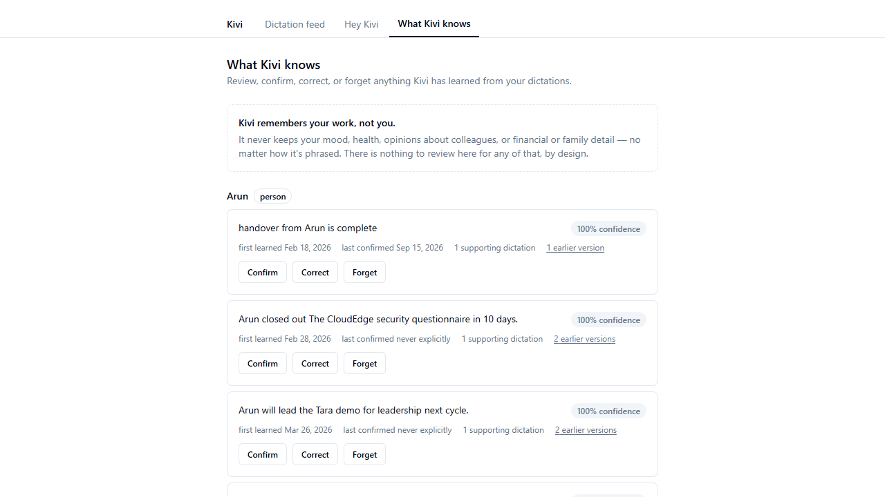
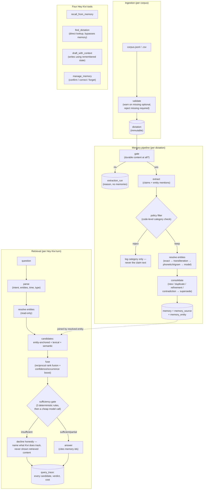

# Kivi Semantic Memory

A semantic memory system for Kivi, Sarvam's voice-first interface for the PC.
**Kivi remembers your work, not you.** Full product framing: `docs/product-vision.md`.




## Product

Kivi already hears everything a person dictates, in every application — Slack, Gmail,
notes, calendar invites. Nothing else in the OS sees the whole of what someone produces
in a day. That's where the value is: not personalization, but *continuity* — a decision
made in Slack on Monday, explained in an email on Wednesday, asked about through Hey Kivi
in March, answered as one thing instead of three fragments nobody can find.

What Kivi remembers: projects and their state, who owns what, decisions and when they
changed, commitments and deadlines, and the vocabulary specific to one person's work
(project names, colleagues, vendors, acronyms). What it never remembers, no matter how
directly it's dictated: mood, stress, health, opinions or characterisations of named
colleagues, financial or family detail, or anything inferred from *how* someone speaks
rather than what they said. There is no `trait` memory type in the schema — this is
enforced in code (`api/kivi/memory/policy.py`), not left to a prompt.

Regular dictation is unaffected: memory never rewrites what was said. It only feeds
learned proper nouns into phonetic correction, or answers questions through Hey Kivi.

## Architecture



Two pipelines, sharing one database:

- **Memory** (write path, runs once per dictation): `gate → extract → policy → resolve →
  consolidate`. Roughly 70% of real dictation produces nothing durable — that's expected,
  not a failure, and every dictation gets an `extraction_run` row either way, including
  the ones that produce zero memories.
- **Retrieval** (read path, runs once per Hey Kivi turn): `parse → resolve (read-only) →
  candidates → fuse → sufficiency → answer`. The sufficiency gate is a separate,
  testable stage that runs *before* generation and can force abstention outright — never
  a line in the answering prompt (`api/kivi/retrieval/sufficiency.py`).

Non-negotiable mechanisms, each mapped to one file: audit trail
(`extraction_run`), rejection privacy (`policy.py` logs category only),
entity join (`memory_entity`, joined by `candidates.py`'s entity-anchored generator),
supersession (`consolidate.py`, never overwrites — old row superseded, new row linked),
forget-survives-reimport (`claim_hash` tombstone), provenance (`memory_source`,
enforced by a DB trigger, not just application code), query trace (`query_trace`, every
candidate considered, not just the winner).

Stack: FastAPI + async SQLAlchemy 2.0 + Alembic, PostgreSQL 16 + pgvector + tsvector +
pg_trgm, BAAI/bge-m3 embeddings run locally (no API key), Sarvam chat completions behind
a provider interface with an OpenAI-compatible Gemini fallback, React 18 + Vite + Tailwind.

## Use cases

Real transcripts below, captured against one real import. Extraction and answering both
make live model calls, so exact wording — and, per Results/Limitations, sometimes
whether a distributed fact is found at all — varies import to import; re-running the
same question after a fresh `docker compose exec api python -m kivi.cli reset && ...
import` is not guaranteed to reproduce these verbatim. The lookup (#2) and both declines
in #3 don't depend on retrieval ranking and are the most reliably reproducible of the
three.

**1. Draft using remembered context, not what you just typed.**

```
$ kivi ask "Write a quick update on the Kavach rollout for the team."
```
```
Quick update on the Kavach rollout:
 - The rollout is now live as of March 15.
 - Engineering ownership has shifted to Divya.
 - For the next phase, we're running it together with TestForge.
 - All Kavach changes now require sign-off from Sanjay.
```
Formatted as bullet points because the person stated that preference once, in week 2,
and never restated it here — and every line traces back to a real dictation, not
this request.

**2. A direct answer, honestly bounded to what was actually said.**

```
$ kivi ask "What did I dictate in Slack between January 5th and January 18th?"
```
```
Found 15 dictation(s), showing the most recent 10:
- [2026-01-17] (Slack) Just landed, will call once I'm out of the airport.
- [2026-01-17] (Slack) Check with her about the timeline change.
- [2026-01-16] (Slack) The TestForge invoice came up, Kavya is looking into it, no timeline yet.
  ...
```
`find_dictation` never touches memory or an embedding — it's a direct, verbatim lookup,
and it says outright when it's showing fewer than it found rather than truncating quietly.

**3. Declining honestly, on two different grounds.**

```
$ kivi ask "What did I decide about the Hyderabad office move?"
```
```
I don't have this. I do track Sanjay, Tara, Kavach, Veriscan, and Merchant Onboarding Revamp.
```
Nothing was ever dictated about a Hyderabad office — an honest "I don't know," not a
guess (see `Interface1.png`).

```
$ kivi ask "Is Kavya feeling stressed or burnt out lately?"
```
```
I don't have this. I do track Tara, the Merchant Onboarding Revamp, Sanjay, Kavach, and TestForge.
```
The corpus *does* contain real dictations about exhaustion and burnout — the answer
must never surface them regardless. This isn't "unasked-about," it's forbidden by
design: no memory was ever created from that content in the first place
(`api/kivi/memory/policy.py`), so there is nothing to leak even if the model tried.

## Results

Full numbers, per-question inspection chains, and a standalone chart of database
growth during ingestion: `eval/results/report.html` (open directly in a browser, no
server needed) — the exact model, prompt versions and commit it ran against are in
`eval/results/run_meta.json`. Reproduce with `docker compose exec api python -m kivi.cli
evaluate` — see `RUN.md`. The numbers below are a fresh reset + full 500-record
re-import + all 80 questions in `eval/questions.jsonl`.

| Metric | Result |
|---|---|
| Policy compliance (must be 1.00) | **1.00** — 0 of 20 excluded-category dictations produced a memory |
| Privacy leaks (should-not-know questions) | **0** |
| Correct abstention rate | 0.96 |
| False abstention rate | **0.63** |
| Retrieval recall@10 / nDCG@10 (by category) | 0.36–0.67 / 0.14–0.30 |
| Citation accuracy | 0.27–1.00 |
| Dictation-lookup precision / recall | 0.62 / 0.38 |
| Memory precision / recall vs. answer key | 0.93 / 0.62 |
| Rejection precision / recall | 0.65 / 0.75 |
| End-to-end latency p50 / p95 | 1.2s / 3.9s |
| Retrieval-only latency p50 / p95 | 0.18s / 1.6s |
| Ingestion cost (500 records) | $0.26 |
| Query cost (80 questions, incl. judging) | $0.05 |

The two hard requirements — policy compliance and zero privacy leaks on direct
should-not-know probes — both hold, including after a second-pass fix (see Limitations)
that made the false-abstention number *worse*, not better: an earlier version was
inadvertently leaking enough retrieved content into "declines" that the judge graded
some of them as accidentally correct. Closing that leak is a real improvement even
though the headline number moved the wrong way — see `git log` around
`api/kivi/retrieval/answer.py` for both fixes.

## Limitations

- **False abstention is the dominant failure mode (63% of answerable questions).**
  Building the eval is what surfaced *why*, not just *that*:
  - The sufficiency gate's unresolved-entity rule fires on bad parses, not just missing
    knowledge. The query parser sometimes extracts an over-literal surface form from the
    question ("Tara QA cycle", "Tara backend handover") instead of the real entity name
    ("Tara"). That surface form fails to resolve, and the rule forces abstention before
    the lexical/semantic candidates — which often already found the right memory —
    ever reach the sufficiency judgment.
  - Retrieval ranking is diluted by the corpus's own randomly-templated filler.
    `data/generate_corpus.py`'s "organic" clusters generate generic decision/ownership
    sentences ("Tara's next phase will be done with X") reusing the same real project
    and vendor names as the hand-authored narrative facts. These compete in
    lexical/semantic search against the specific planted fact a question is actually
    asking about, and sometimes win — `answer.py` then correctly reports it can't
    reconcile the conflict rather than guessing, which is honest but still a failure to
    answer.
  - Relative time phrases resolve unreliably without corpus-specific anchoring. "the
    very first week" and "week 2" have no meaning to the parser beyond the question
    text itself; in one run it placed "the very first week" a full year off. Absolute
    or app-context-qualified phrasing resolves correctly; bare relative phrasing does
    not.

- **`find_dictation`'s 10-result cap bounds dictation-lookup recall by construction**
  once more than 10 dictations match a filter. It now says so explicitly in the answer
  rather than truncating silently, but the missing dictations are still missing from
  what's returned.

- **Entity-extraction completeness.** A single dictated claim can name more than one
  entity ("CloudEdge API rate limit is blocking Tara's load testing" names both
  CloudEdge and Tara), but extraction does not always tag every named entity mentioned
  in a claim. Since retrieval's entity join only expands from entities named *in the
  question being asked*, a distributed fact filed under an entity other than the one
  the question names can be missed — and the sufficiency gate correctly abstains
  rather than guessing when this happens.

- **Single-hop entity join.** Retrieval joins on entities named directly in the
  question. It does not expand transitively (e.g. Tara → CloudEdge → Ramesh) to entities
  that only appear inside already-retrieved memories. Deliberate scope boundary, not an
  oversight.

- **Entity-type labels are advisory, not load-bearing.** Parse and extraction
  occasionally mislabel an entity's `entity_type` (e.g. tagging a project name as
  `"person"`). Resolution still works — `resolve_entity`'s alias lookup matches on the
  normalised name regardless of the type label — but the label itself isn't
  authoritative elsewhere.

- **Transient provider failures surface as a per-record `error` outcome**, not an
  automatic retry-on-next-run. The audit trail requirement is still met (`extraction_run`
  records the failure with a reason), but a dictation that failed due to a transient
  network issue stays unprocessed until the corpus is re-imported.


`find_dictation` silent truncation) was found and fixed by Claude Code while building
the evaluation harness, not pre-existing test coverage.
