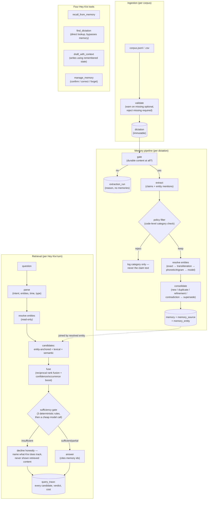

# Architecture

Two pipelines share one PostgreSQL database: a write path that turns dictation into
memory, and a read path that turns a Hey Kivi question into an answer.

## Memory pipeline (write path)

Runs once per dictation, orchestrated by `api/kivi/memory/pipeline.py`:

1. **Gate** (`gate.py`) — a cheap model call: does this dictation contain anything that
   will still matter a month from now? Most real dictation (~70% in the reference
   corpus) is acknowledgements, transient scheduling, or restated context, and is
   filtered out here before extraction ever runs.
2. **Extract** (`extract.py`) — pulls structured claims (text, category, entity
   mentions) out of what passed the gate. Self-containment and pronoun-resolution are
   enforced twice: once in the prompt, once again in code (`_has_unresolved_pronoun`),
   because a prompt alone is not trusted to hold a boundary.
3. **Policy** (`policy.py`) — a pure function checking the claim's category against
   `KEEP_CATEGORIES` in code, never trusting the prompt's own categorisation. On
   rejection, only the category is logged (`extraction_run.policy_rejections`) — never
   the claim text, which would recreate the store the policy forbids.
4. **Resolve** (`resolve.py`) — four passes, cheapest first: exact alias match,
   transliteration-normalised match, phonetic/trigram similarity, model-assisted
   disambiguation only when two or more candidates tie. New entities start at low
   confidence and graduate to 1.0 on a second unambiguous match.
5. **Consolidate** (`consolidate.py`) — decides whether a claim is new, a duplicate
   (bumps `occurrence_count`), a refinement, or a contradiction. Contradictions never
   overwrite: the old `memory` row is marked `status=superseded`, `valid_to` set, and
   `superseded_by_id` links to the new row.

Every dictation gets an `extraction_run` row regardless of outcome, with a
plain-language reason — this is the audit trail, and it's what makes "was this
dictation ever processed, and why did nothing come of it" answerable for every one of
the ~70% that produce nothing.

## Retrieval pipeline (read path)

Runs once per Hey Kivi turn, orchestrated by `api/kivi/retrieval/ask.py`:

1. **Parse** (`parse.py`) — intent (`find` / `recall` / `act` / `chitchat`), named
   entities, a time window, an optional memory-type filter, an app-context filter, and
   whether the question itself is asking for excluded content (mood, health, etc.) —
   in which case retrieval is skipped entirely and the decline is immediate.
2. **Resolve** (read-only) — same four-pass resolution as ingestion, but
   `create_if_missing=False`: a question can never mint a new entity.
3. **Candidates** (`candidates.py`) — three independent, unscored-vs-scored
   generators: entity-anchored (everything linked to a resolved entity — this is the
   join that recovers distributed facts), lexical (`ts_rank_cd` over a `tsvector`), and
   semantic (pgvector cosine distance over the `bge-m3` embedding).
4. **Fuse** (`fusion.py`) — reciprocal rank fusion across the three generators, then
   hard filters (time window, memory type), then a confidence/occurrence-count boost,
   then pinned-first ordering. The trace kept from this stage covers *every* candidate
   any generator surfaced, not just the winners.
5. **Sufficiency** (`sufficiency.py`) — a separate, testable stage that runs *before*
   generation. Three deterministic rules (an unresolved entity mention, a fused score
   below a configured floor, exactly one low-confidence supporting memory) can each
   force an insufficient verdict without ever calling a model; only when none of them
   fire does a cheap model call render sufficient/partial/insufficient.
6. **Answer** (`answer.py`) — on sufficient/partial, answers using only the retrieved
   memories' text, with recency and supersession context. On insufficient, the model is
   never shown the retrieved memories' content or even the sufficiency stage's own
   explanation of why it declined (both can restate what was found) — only the names of
   entities Kivi does track.

Every turn writes one `query_trace` row: the parsed filters, every candidate any
generator surfaced with its component scores, what was ultimately selected and cited,
the sufficiency verdict and reason, tokens, cost, and latency split between retrieval
and generation.

## The four Hey Kivi tools

`api/kivi/tools/` — deliberately four, no more:

- **`recall_from_memory`** — the retrieval pipeline above, answering a question.
- **`find_dictation`** — a direct filter over `dictation` by app context and/or time
  window. Never touches memory or an embedding, so it's fast (milliseconds, not
  seconds) and immune to any retrieval-quality issue.
- **`draft_with_context`** — runs parse → resolve → candidates → fuse, then asks for a
  draft instead of an answer. No sufficiency gate: a draft with fewer specifics is
  still a valid draft, unlike an answer with no support.
- **`manage_memory`** — `confirm` (bumps `last_confirmed_at`), `correct` (supersedes
  the old memory, creates a new one with `origin=user, confidence=1.0, pinned=True`),
  `forget` (marks `status=forgotten` and writes a `claim_hash` tombstone that survives
  re-import).

## Stack

FastAPI + async SQLAlchemy 2.0 + Alembic (Python 3.11), PostgreSQL 16 + pgvector (HNSW
cosine index) + `tsvector` (GIN) + `pg_trgm`, BAAI/bge-m3 embeddings run locally via
`sentence-transformers` (no API key), Sarvam chat completions behind a provider
interface (`api/kivi/models/provider.py`) with an OpenAI-compatible Gemini fallback,
React 18 + Vite + Tailwind + shadcn/ui on the frontend.
